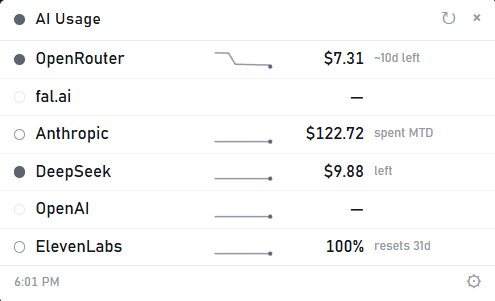

# AI Usage

One tray panel for every AI provider you pay: what's left, what you've spent, and how fast it's going.



Most providers won't tell you your balance without opening their dashboard. This polls the ones that will, normalizes them, and puts the answer a click away — with a burn rate measured from your own history, not guessed from a monthly average.

## Providers

| Provider | Reports | Key needed |
|---|---|---|
| OpenRouter | balance + usage | normal API key |
| DeepSeek | balance | normal API key |
| ElevenLabs | monthly character quota + reset date | normal API key |
| Anthropic | month-to-date spend | **admin** key (`sk-admin…`) |
| OpenAI | month-to-date spend | **admin** key (`sk-admin…`) |
| fal.ai | balance | **billing-scoped** key (a normal key returns 403) |

Providers with no usage API at all — Claude Max, Hugging Face, Gemini, Together, Groq, Replicate, Perplexity — can't be tracked by anyone. See [the report card](reportcard/index.html).

> **About admin keys.** Anthropic and OpenAI only expose spend through *admin-scoped* keys, which can do far more than read costs (manage org members, create keys). That's their API design, not this app's choice. This app only ever calls their cost endpoints — each adapter in `app/engine/adapters/` is a single short file you can read — but understand what you're pasting: an admin key is a bigger grant than an inference key. Create a dedicated one and revoke it if you stop using the app.

## How it works

- **Balance vs spend is explicit.** `left` counts down, `spent MTD` counts up — they're different billing models and conflating them misleads you.
- **Burn rate is measured**, from observed balance deltas, ignoring top-ups and billing-period rollovers. Runway (`~10d left`) comes from that, not from dividing a monthly total.
- **Alerts** fire when a provider crosses into low/critical, and when the last hour runs >4× your normal burn — the runaway-script case.
- **Keys live in the OS credential store** (Windows Credential Manager), never in a file or this repo. The app can only reach the six provider hosts it's allow-listed for.

## Build

Needs Node 22 and Rust.

```sh
cd app/desktop
npm install
npm run tauri dev      # run it
npm run tauri build    # installer -> src-tauri/target/release/bundle/
```

> Build releases with `npm run tauri build`, **not** `cargo build --release` — only the former enables Tauri's `custom-protocol` feature, without which the binary still points at the dev server and loads a blank page.

Then click the tray icon → ⚙ → paste keys.

The engine runs headless too:

```sh
node app/engine/cli.mjs --mock   # no keys, no network
node app/engine/selfcheck.mjs    # 57 assertions
```

## The `ai-usage` manifest

The awkward part of this project is that every provider is different. [`spec/`](spec/SPEC.md) proposes a small, authenticated JSON document a provider could serve so any client reads balance/spend/quota with no per-provider code. It's CC0 — copy it, ship it, no attribution needed.

## Status

Windows-only in practice (the code is cross-platform; nothing else has been tested). Source only — no signed binaries, so builds are your own. Early: expect rough edges.

Issues welcome — especially provider requests with a link to the usage endpoint. No support promised.

## License

The app is [MIT](LICENSE). The [`ai-usage` manifest spec](spec/SPEC.md) is CC0 — public domain, so providers can implement it without touching a license at all.
